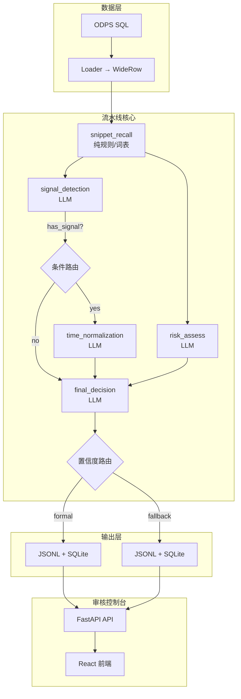

# 职位新鲜度识别流水线 (Freshness Pipeline)

平台职位投诉中"已招满"和"电话打不通"两类占比高达 72%，主要原因是职位信息时效性过时。本系统从订单类/零工职位的发布内容和近期交互证据中自动提取时效性线索，产出结构化新鲜度结果，为精准分发、主动提醒、自动下架提供数据基础。

本期范围覆盖**识别流水线**和**审核控制台**，不实现提醒、强呼、自动关闭、流量分发等下游策略。

## 核心能力

| 能力 | 说明 |
|------|------|
| **时效信号提取** | 从 job_detail、im_text、asr_result 中识别开工时间、招聘截止时间、工期等时间语义 |
| **风险评估** | 从投诉文本和交互计数特征中独立评估职位陈旧风险 |
| **最终决策** | 综合时效信号和风险评估，产出结构化新鲜度标签（`has_signal` / `no_signal` / `cannot_determine` / `conflict`） |
| **审核控制台** | Web 界面查看流水线结果分布、单条详情、原始证据，支持飞书 OAuth 登录 |

## 技术栈

| 层 | 技术 |
|----|------|
| 后端 | Python 3.11+, FastAPI, LangGraph, Pydantic 2.8+, PyODPS, httpx |
| 前端 | React 19, TypeScript, Vite, Tailwind CSS 4, Motion |
| 数据 | MaxCompute (ODPS), SQLite, JSONL |
| 测试 | pytest, hypothesis (property-based) |
| 包管理 | uv + pyproject.toml (后端), npm (前端/monorepo 脚本) |

## 流水线架构



**执行流程**：

1. `snippet_recall`（纯规则）用词表 + 正则从文本中高召回截取片段
2. `signal_detection` 和 `risk_assess` **并行**执行 — signal_detection 只看召回的非投诉 snippet，risk_assess 只看投诉文本和计数特征
3. `time_normalization` **条件触发** — 仅当检测到时效信号时调用 LLM 归一化时间字段
4. `final_decision` 汇聚两层结果，产出最终决策，按置信度路由到 formal 或 fallback 输出

**关键设计约束**：投诉文本和计数特征**不可**用于伪造时间戳，两层业务逻辑严格隔离。

## 环境搭建

### 前置条件

- Python 3.11+
- Node.js 18+
- [uv](https://docs.astral.sh/uv/) 包管理器

### 安装依赖

```bash
# 后端
cd backend && uv sync

# 前端
cd frontend && npm install
```

### 配置环境变量

```bash
cp backend/.env.example backend/.env
```

编辑 `backend/.env`，至少填写以下配置：

```dotenv
# LLM API（必填其一）
DASHSCOPE_API_KEY=your-key-here
# 或
OPENAI_API_KEY=your-key-here

# ODPS 连接（生产环境必填）
ODPS_ACCESS_KEY_ID=your-id
ODPS_ACCESS_KEY_SECRET=your-secret
ODPS_PROJECT=yuapo_dev
ODPS_ENDPOINT=http://service.cn.maxcompute.aliyun-inc.com/api
```

完整配置项参见 `backend/.env.example`。

## 运行方式

### 开发服务

```bash
# 启动后端 API（热重载，端口 8080）
npm run dev:backend

# 启动前端开发服务（端口 7070）
npm run dev:frontend
```

后端 API 文档：`http://localhost:8080/docs`（Swagger UI）
前端控制台：`http://localhost:7070`

### Dry-Run 模式（Mock 数据验证）

使用内置样本数据验证流水线，不发起真实网络请求：

```bash
npm run dry-run:backend
```

等价原生命令：

```bash
cd backend
uv run python -m job_freshness.main --pt 20260420 --mode dry-run
```

### Fetch 模式（从 ODPS 拉取数据）

从 ODPS 拉取职位宽表数据，保存为 JSON：

```bash
# 拉取数据
cd backend
uv run python -m job_freshness.main --pt 20260420 --mode fetch --output-dir output/data/

# 限制条数（调试用）
uv run python -m job_freshness.main --pt 20260420 --mode fetch --max-rows 100
```

### Fetch-Run 模式（拉取 + 识别一站式）

自动完成：ODPS 拉取 → WideRow 归一化 → 流水线识别 → 输出结果：

```bash
cd backend
uv run python -m job_freshness.main \
  --pt 20260420 \
  --mode fetch-run \
  --output-dir output/ \
  --max-rows 50 \
  --worker-count 4 \
  --provider-rate-limit-per-minute 60
```

### Run / Run-Single 模式（使用真实 LLM）

对已有的 JSON/JSONL 数据文件运行流水线：

```bash
cd backend

# 单条测试
uv run python -m job_freshness.main --pt 20260420 --mode run-single --input-path output/data/freshness_candidates_20260420.json

# 批量运行
uv run python -m job_freshness.main --pt 20260420 --mode run --input-path output/data/freshness_candidates_20260420.json
```

### 运行时参数

| 参数 | 默认值 | 说明 |
|------|--------|------|
| `--pt` | T-1 | 业务日期分区（yyyymmdd） |
| `--mode` | 必填 | `dry-run` / `fetch` / `fetch-run` / `run` / `run-single` |
| `--input-path` | — | JSON/JSONL 输入文件路径（run/run-single 模式） |
| `--output-dir` | output | 输出目录 |
| `--format` | json | 数据输出格式（fetch 模式用） |
| `--max-rows` | 无限制 | ODPS 最大拉取条数（fetch/fetch-run 模式用） |
| `--worker-count` | 4 | 并发工作线程数 |
| `--provider-rate-limit-per-minute` | 120 | LLM 调用限流（次/分钟） |
| `--max-in-flight` | 8 | 最大并发任务数 |
| `--timeout-seconds` | 30 | 单任务超时（秒） |
| `--retry-limit` | 1 | 失败重试次数 |

### 运行测试

```bash
# 全部后端测试（单元 + 集成）
npm run test:backend

# 仅单元测试
npm run test:backend:unit

# 仅集成测试
npm run test:backend:integration

# 前端类型检查
npm run lint:frontend
```

## 项目结构

```
├── backend/
│   ├── src/job_freshness/    # 后端源码（包路径暂保留）
│   │   ├── nodes/                      # LangGraph 节点（每个节点 = service + prompt_builder + parser）
│   │   │   ├── snippet_recall/         #   纯规则：词表 + 正则片段截取
│   │   │   ├── signal_detection/       #   LLM：时效信号检测
│   │   │   ├── time_normalization/     #   LLM：时间归一化（条件执行）
│   │   │   ├── risk_assess/            #   LLM：风险评估
│   │   │   └── final_decision/         #   LLM：最终决策
│   │   ├── prompts/                    # Prompt YAML 模板（v1）
│   │   ├── writers/                    # 输出写入器（JSONL + SQLite 双写）
│   │   ├── api/                        # FastAPI 审核控制台 API
│   │   │   ├── server.py              #   应用工厂 + CORS + 依赖注入
│   │   │   ├── routes.py             #   路由定义
│   │   │   ├── services.py           #   业务逻辑层（SQLite 查询）
│   │   │   ├── schemas.py            #   请求/响应 Pydantic 模型
│   │   │   └── auth.py               #   飞书 OAuth 认证
│   │   ├── llm/                        # LLM 客户端封装
│   │   ├── graph.py                    # LangGraph 图定义（5 节点 + 2 输出节点）
│   │   ├── graph_state.py             # 流水线状态模型
│   │   ├── schemas.py                 # 领域 Pydantic 模型（WideRow, *Record 等）
│   │   ├── data_fetcher.py            # ODPS 数据拉取（3 次重试 / 5s 间隔）
│   │   ├── loader.py                  # SQL 行 → WideRow 归一化
│   │   ├── settings.py                # 配置加载（.env → Pydantic）
│   │   └── sql_template.py            # SQL 模板渲染（${bizdate} 占位符）
│   ├── sql/
│   │   └── fetch_freshness_candidates.sql   # ODPS 数据提取 SQL
│   ├── tests/
│   │   ├── unit/                       # 单元测试
│   │   └── integration/                # 集成测试 + mock fixtures
│   └── pyproject.toml
│
├── frontend/
│   ├── src/
│   │   ├── api/
│   │   │   ├── client.ts              # API 客户端（自动 snake_case ↔ camelCase）
│   │   │   └── types.ts               # TypeScript 类型定义
│   │   ├── components/
│   │   │   ├── DateSelector.tsx        # 日期分区选择器
│   │   │   └── DateRangeView.tsx       # 日期范围查询视图
│   │   └── App.tsx                     # 主应用（侧边栏 + 仪表盘 + 审核列表 + 详情面板）
│   └── package.json
│
├── config/
│   └── recall_lexicon_v1.json          # snippet_recall 词表 + 正则配置
│
├── tools/
│   └── backend-command.mjs             # monorepo 后端命令包装器
│
├── package.json                        # monorepo 统一脚本入口
└── AGENTS.md                           # AI Agent 协作规范
```

## 数据模型概览

### 输入

**WideRow** — 从 ODPS 宽表归一化的单条职位记录：

| 字段　　　　　　　　| 类型　　| 说明　　　　　|
| ---------------------| ---------| ---------------|
| `user_id`　　　　　 | str　　 | 用户 ID　　　 |
| `info_id`　　　　　 | str　　 | 职位 ID　　　 |
| `job_detail`　　　　| str　　 | 职位详情文本　|
| `asr_result`　　　　| str　　 | 通话 ASR 转写 |
| `im_text`　　　　　 | str　　 | IM 聊天记录　 |
| `complaint_content` | str　　 | 投诉内容　　　|
| `im_message_count`　| int ≥ 0 | IM 消息数　　 |
| `call_record_count` | int ≥ 0 | 通话记录数　　|
| `complaint_count`　 | int ≥ 0 | 投诉次数　　　|
| `publish_time`      | str?    | 职位发布时间　|

### 输出

**FreshnessDecisionRecord** — 最终决策记录：

| 字段 | 说明 |
|------|------|
| `temporal_status` | `has_signal` / `no_signal` / `cannot_determine` / `conflict` |
| `signal_type` | `absolute_datetime` / `date_range` / `relative_time` / `duration_only` / `holiday_window` / `vague_time` / `no_signal` / `conflict` |
| `work_start_at` | 开工时间（ISO 8601） |
| `recruitment_valid_until` | 招聘截止时间（ISO 8601） |
| `duration_hours` | 工期（小时） |
| `confidence` | 综合置信度 0.0–1.0 |
| `stale_risk_hint` | 是否存在过期风险 |
| `complaint_risk_hint` | 投诉风险详情 |
| `risk_score` | 风险分数 0.0–1.0 |
| `decision_reason` | 决策理由 |
| `low_confidence` | 是否低置信（决定 formal/fallback 路由） |

### 输出目录

按业务日期分区：

```
output/{pt}/
├── formal_output.jsonl        # 高置信结果
├── fallback_output.jsonl      # 低置信/错误结果（待人工审核）
├── pipeline_results.sqlite3   # 完整审计记录（含 step-level 中间结果）
└── run_summary.json           # 运行摘要
```

## API 端点

| 端点 | 方法 | 说明 |
|------|------|------|
| `/api/stats` | GET | 时效状态分布 + 信号类型分布 |
| `/api/runs` | GET | 分页运行记录列表 |
| `/api/runs/{run_id}` | GET | 单条运行详情（含 step-level audit） |
| `/api/search` | GET | 按 info_id 搜索 |
| `/api/batch` | POST | 触发批量流水线任务 |
| `/api/dates` | GET | 可用日期分区列表 |
| `/api/daily-summary` | GET | 日期范围内每日摘要 |
| `/api/settings` | GET/PUT | 系统配置（管理员） |
| `/api/auth/*` | — | 飞书 OAuth 认证 |

## 版本化设计

流水线使用多维度版本号，缓存键包含所有版本维度，版本变更自动使缓存失效：

| 维度 | 说明 | 示例 |
|------|------|------|
| `feature_schema_version` | 数据 schema 版本 | v1 |
| `graph_version` | 流水线图版本 | v1 |
| `prompt_version_{node}` | 各节点 Prompt 版本 | v1 |
| `model_version_{node}` | 各节点 LLM 模型版本 | qwen3-max |

## 相关文档

- 需求文档：`.kiro/specs/freshness-pipeline-migration/requirements.md`
- 设计文档：`.kiro/specs/freshness-pipeline-migration/design.md`
- 实施计划：`.kiro/specs/freshness-pipeline-migration/tasks.md`
- 业务背景：`doc/【新增】智能识别订单类职位时效性标签.md`
- Agent 协作规范：`AGENTS.md`
